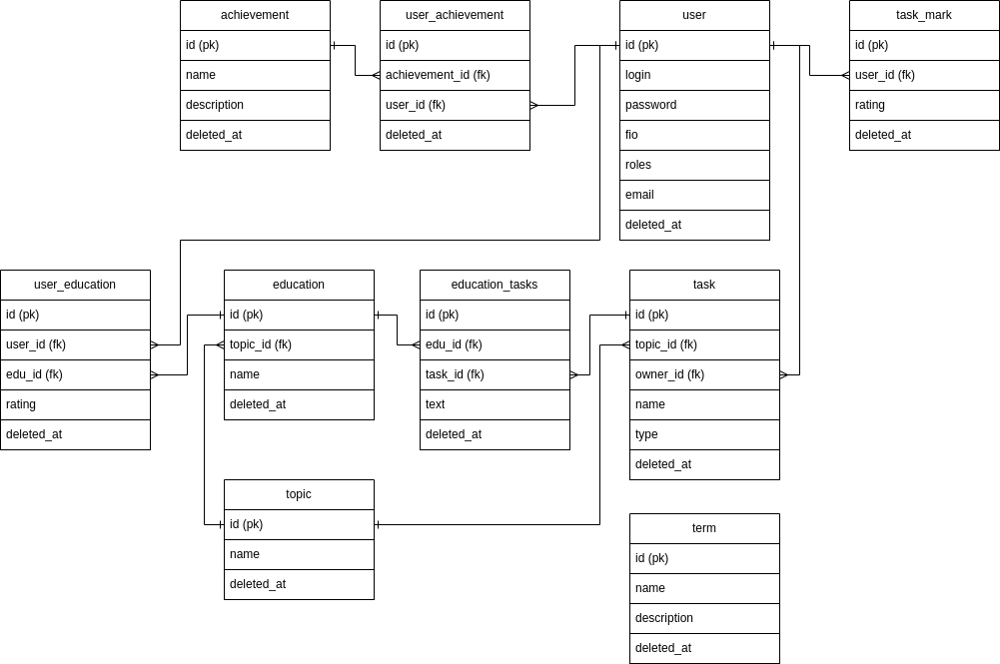

# Текущая схема данных БД
## phpstorm model

## model

## планируемая модель

## TODO: 
- [x] Нормальные названия Schema's
- [x] Связать task_mark и task
- [x] Добавить оставшиеся сущности
- [ ] Фикстуры для:
  - [x] Терминов
  - [x] Темы (топики)
  - [x] Список литературы (может относиться к нескольким топикам)
  - [ ] Достижений (можно глянуть как работать с картинками)
  - [ ] Достижения + Пользователь
  - ...
- [ ] Одновременно с фикстурами - контроллеры
- [ ] Попробовать Voter + 
  добавить пояснялку про различные права пользователей в Swagger
- [ ] Тесты для авторизации с различными ролями + доступные urls